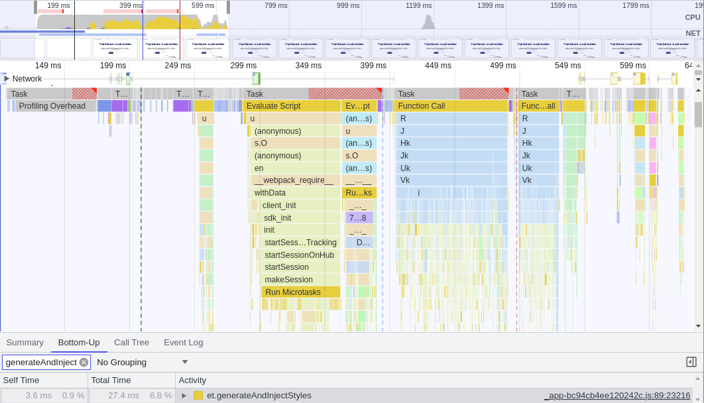

# Description

This document is an analysis of the performance impact of styled-components in our codebase as measured early July 2023. It is meant to help with the Tailwind RFC, which considers replacing styled-components with Tailwind, to make an informed decision about how much
performance we could gain by doing so.

# Methodology

## Setup

- Using a local build without custom server (`NEXT_USE_FILESYSTEM_ROUTING=true NODE_ENV=production npx next build`)
- Starting the local server with `NODE_ENV=production npx next start`
- Using an Incognito Chrome session (to prevent any extensions from interfering with the results), logged out, with a viewport of ~1150x500
- Using production API endpoints
- The results are collected on a modern laptop (Linux, Fedora 38, 11th Gen Intel® Core™ i7-1165G7 × 8 @ 2.80GHz, Intel® Xe Graphics (TGL GT2), 32GB RAM)

## Profiling

1. Open the [local website](http://localhost:3000)
2. Open the Chrome DevTools
3. Open the Performance tab
4. Click the Record button
5. Load the page (or start using the page when testing re-renders)
6. Click the Stop button

We're then considering styled-components impact by looking at the `generateAndInjectStyles` function. This function is styled-component's main entrypoint, and though we may miss some of the time spent there, it should give us a good idea of the general metrics.

## Analyzed pages

- [Home page](http://localhost:3000): a static page without any data loading. Makes an extended use of styled-components with various components (carousel, cards, typography, etc.). Pretty comprehensive and
  easy to analyze.
- [Babel profile page](http://localhost:3000/babel): a page that loads data from the API and displays it. Heavy components (new budget, contributors grid, etc.), dynamic styles (custom primary color, a background image with cropping, etc.). A good example of a page that is not static and uses styled-components heavily.
- [Contribution flow](http://localhost:3000/donate): a page with many re-renders that happen as we go through the flow and fill in the form. To analyze the impact of styled-components on re-renders. Testing flow:
  1. Load page
  2. Click on "Monthly"
  3. Click on "Other"
  4. Enter "42.42" for amount
  5. Click on "Continue"
  6. Type "test@opencollective.com" for email
  7. Type "Test" for name
  8. Click on "Continue"

# Data

## Home page

### Loading time

9 ms Loading
290 ms **Scripting**  
37 ms Rendering
5 ms Painting
146 ms System
42 ms Idle
**529 ms Total**

### Flame chart

Time spent in styled-components: 27.4 ms (9.4% of the scripting time, 5.2% of the total render time)

## Babel profile page

11 ms Loading
494 ms **Scripting**
95 ms Rendering
42 ms Painting
177 ms System
21 ms Idle
**839 ms Total**

### Flame chart

Time spent in styled-components: 50.9ms (10.3% of the scripting time, 6.1% of the total render time)

## Contribution flow

4 ms Loading
1614 ms **Scripting**
197 ms Rendering
121 ms Painting
271 ms System
15199 ms Idle
**17407 ms Total**

### Flame chart

Time spent in styled-components: 327.2ms (20.3% of the scripting time, 16.9% of the total render time)

# Conclusion

- How much time is spent in styled-components?

  Page renders are mostly dominated by scripting time, and styled-components is responsible for at least 5-10% of this scripting time during the first load.
  When re-rendering, styled-components is responsible for 10-20% of the scripting time.

- Would getting rid of styled-components have a significant impact on the performance of the website?

  On some pages we could gain 5-10% of the total render time for first render. It's important to mention that `generateAndInjectStyles` is blocking, so what that really means is a decrease of 10% of the time to first render.
  In pages with heavy re-renders (mostly forms - contribution flow, expense flow, etc) the interface could end up being up to 20% more responsive.

- Would Tailwind be really faster?

  While Tailwind will not impact the scripting time at all, we cannot guarantee without further testing that its CSS won't be heavier to parse and render. We can assume that it will be lighter, since according to the [docs](https://tailwindcss.com/docs/optimizing-for-production):

  > Tailwind CSS is incredibly performance focused and aims to produce the smallest CSS file possible by only generating the CSS you are actually using in your project.
  > Combined with minification and network compression, this usually leads to CSS files that are less than 10kB, even for large projects. For example, Netflix uses Tailwind for Netflix Top 10 and the entire website delivers only 6.5kB of CSS over the network.

  Overall, it seems safe to assume that Tailwind, compared to styled-components, will bring a net performance gain.
